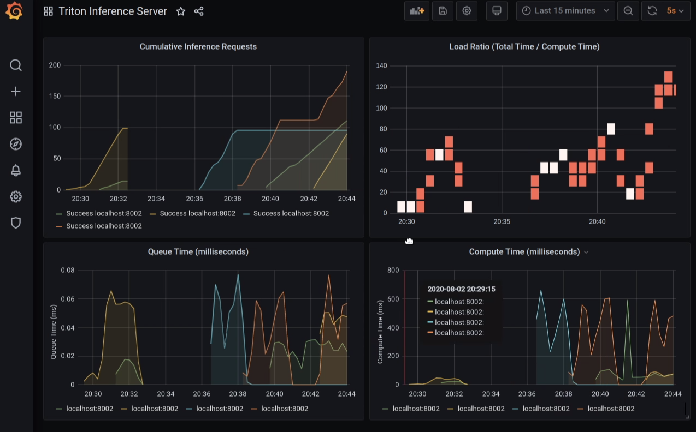

This brach of the repository hosts *Updated* codes for the [Healthcare on Tap](https://event.on24.com/eventRegistration/EventLobbyServlet?target=reg20.jsp&partnerref=devnws&eventid=2355478&sessionid=1&key=F89A7BE8742F98334CEDDA4E86A6D5F0&regTag=1055756&sourcepage=register) series webinar titled "Deeper Dive into TensorRT and TRITON" recorded on 08/06/2020.

**These codes use newer containers and work with V2 TRITON API. [Check here](https://github.com/triton-inference-server/server/blob/master/docs/v1_to_v2.md) for more details.**

# Setting up the environment

```
All tests were performed using 
- Docker version 19.03
- NVIDIA GPUS (RTX 8000 and V100) with driver 450.57
```

Use the startDocker.sh script as follows to mount a data directory and choose GPU 2 for your tests. Current setup uses `nvcr.io/nvidian/pytorch:20.11-py3` as the base image.

```
./startDocker.sh 2 <PATH_TO_DATA>
```
Once inside the container, please use the following script to enable GPU dashboards and start jupyterlab
```
./start_jupyter_lab.sh
```

## TRITON server
A separate container for the server needs to be launched using the script 
```
./start_triton_server.sh 2 <PATH_TO_MODEL_REPO>
```
#### TRITON metrics


To launch Grafana dashboards for monitoring of metrics, please run `docker-compose up` from the [monitoring](./monitoring/) folder and navigate to [localhost:3000/](http://localhost:3000). Additional steps [here](./monitoring/readme.md). **Some metrics for monitoring have changed in the V2 API**.


# Notebooks

The three notebooks in this repository walkthrough the example steps for using 
1. TensorRT [NB1_PyTorch_TRT_ONNX_Inference](./NB1_PyTorch_TRT_ONNX_Inference)
2. TRITON [NB2_TRITON_ClientInference](./NB2_TRITON_ClientInference.ipynb)
3. [NB3_lung_segmentation_3d](./NB3_lung_segmentation_3d.ipynb) walks through a simple 3D example with a graphdef backend. 
* For replicating the experiments, additional clients can be launched to test inference with multiple models. For ex. 
```
python sim_inference_req_triton.py --model model_cxr_onnx
```

# License

This project is being distributed under the [MIT License](./license.md)

The following tools were used as part of this code base and are governed by their respective license agreements. These are in addition to tools distributed within the NGC Docker containers ([Pytorch](https://ngc.nvidia.com/catalog/containers/nvidia:pytorch) / [TRITON](https://ngc.nvidia.com/catalog/containers/nvidia:tritonserver)).

* [MONAI](https://github.com/Project-MONAI/MONAI/blob/master/LICENSE)
* [Netron](https://github.com/lutzroeder/netron/blob/main/LICENSE)
* [NV Dashboard](https://github.com/rapidsai/jupyterlab-nvdashboard/blob/branch-0.4/LICENSE.txt)

Any contributions to this repository are subject to the [Contributor License Agreement](./contributing.md)

# Additional Resources
1. [TRT Sample Code](https://github.com/rmccorm4/tensorrt-utils/tree/master/inference)
2. [TRITON Sample](https://github.com/gigony/triton-test-onnx)
3. [Developer Guide TRT](https://docs.nvidia.com/deeplearning/sdk/tensorrt-developer-guide/index.html)
4. [Developer Guide TRITON](https://docs.nvidia.com/deeplearning/triton-inference-server/user-guide/docs/index.html)
5. [End to End Unet Example](https://developer.nvidia.com/blog/speeding-up-deep-learning-inference-using-tensorrt/)